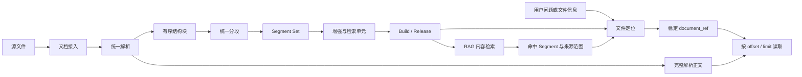

# 文档解析、知识挖掘、文件定位与按行读取总体方案

## 一、背景

现有知识库主要面向 RAG 检索：文档经过解析、分段和知识挖掘后形成检索单元，检索服务根据用户问题返回相关证据片段。

新的 Agentic RAG 场景还需要另一类能力：Agent 不仅要获得若干检索片段，还要能够定位到具体文件，并像使用 Read 工具一样持续读取该文件的原文。

典型需求包括：

1. 用户通过完整文件名、部分文件名或自然语言问题查找目标文件；
2. 系统在当前已发布知识范围内定位文件；
3. 首次调用返回少量原文，帮助 Agent 判断是否找到正确文件；
4. Agent 根据命中位置或阅读进度继续读取指定行范围；
5. 多次读取的结果能够还原完整正文；
6. 阅读过程中即使知识库发布新版本，也不能切换到另一个文件版本。

因此，需要在现有“知识证据检索”之外增加一组“文件定位与连续阅读”能力。

## 二、建设目标

本方案覆盖从源文件进入知识库，到 Agent 检索和连续阅读的完整链路，建设四项相互衔接、职责独立的能力。

### 1. 文档解析

把不同格式的源文件转换成统一、持久化的解析资产，形成：

- 完整可读正文；
- 有序结构块；
- 行号、页码或版面坐标等来源范围；
- 是否支持精确行读取的能力声明；
- 可供后续分段重复消费的稳定 Parse Result。

### 2. 知识挖掘

所有文档格式通过统一 Segmenter 形成可检索资产，完成：

- 结构化分段；
- Segment 来源范围维护；
- 内容增强和实体处理；
- Retrieval Unit 和 Embedding 构建；
- Segment Set 版本化；
- Build 和 Release 发布。

### 3. 文件定位

根据用户输入，在指定知识领域和当前已发布版本中查找最相关的文件，返回：

- 文件身份和路径；
- 文件标题、类型等基础信息；
- 文件是否支持按行读取；
- 与问题相关的原文位置或检索摘要；
- 后续读取使用的稳定文档引用；
- 唯一命中时的一小段原文预览。

### 4. 文件读取

根据已经确定的文档引用，按 `offset` 和 `limit` 读取连续正文，返回：

- 本次实际读取的行号范围；
- 文件总行数；
- 剩余行数；
- 是否还有后续内容；
- 下一次读取使用的 `offset`；
- 对应范围的规范正文。

## 三、不在本期范围内的能力

第一期不包含：

- 原始文件字节下载；
- PDF 物理页面或视觉版面的完整还原；
- 对所有 Office 格式承诺精确行号；
- 使用 Segment 拼接并冒充原始全文；
- 在一次读取请求中重新检索或重新选择文件；
- 自动读取整个长文档并一次性返回。

## 四、核心设计原则

### 1. 搜索与读取分离

文件定位属于不确定操作，可能返回0个、1个或多个候选；文件读取属于确定性操作，必须面向已经固定的文件版本。

因此对外提供两个核心操作：

```text
locate_document
read_document
```

不建议通过一个接口中的不同参数组合来区分搜索和读取行为。

### 2. 读取正文独立于 Segment

Segment 是面向知识挖掘和检索的内容单元，可能经历：

- Markdown 清理；
- 小段合并；
- 孤立片段吸收；
- 长段拆分；
- 结构上下文注入；
- 语义增强。

因此 Segment 不能作为完整正文的真相来源。

按行读取必须使用解析阶段持久化的完整可读正文。Segment 只负责告诉检索服务“相关证据来自正文的哪个范围”。

### 3. `segment_index` 与行号分别承担不同职责

```text
segment_index
  → Segment 顺序
  → 相邻上下文扩展
  → 检索结果内部定位

正文行号
  → Read 范围定位
  → 连续分页
  → 全文拼接
```

两者同时存在，不能互相替代。

### 4. 只读取已发布知识

文件定位只能查询指定领域、指定 Channel 当前生效的 Release，不能读取：

- 尚未发布的挖掘结果；
- 其他领域的数据；
- 已经从当前 Build 移除的文档；
- 同一个 Snapshot 下尚未生效的新分段结果。

### 5. 阅读版本必须稳定

首次定位后，系统返回稳定的 `document_ref`。后续读取始终通过该引用访问同一个 Build 中的文档版本。

如果阅读过程中发布了新 Release：

- 新的 Locate 请求应定位到新版本；
- 已经开始的 Read 链路继续读取旧版本；
- 不允许在分页过程中静默切换版本。

## 五、端到端总体架构

本方案同时覆盖知识资产的生产过程和 Agent 使用过程。



整体分为两个相互解耦的部分：

### 1. 知识生产链路

负责把源文件转换成可发布知识资产：

```text
源文件
  → 文档身份和内容版本
  → 完整解析正文与结构块
  → 统一 Segment
  → Retrieval Unit / Embedding
  → Build / Release
```

### 2. Agent 使用链路

负责在当前已发布知识中定位和阅读文件：

```text
用户问题或文件信息
  → Locate
  → 候选 Document 或唯一 Document
  → document_ref
  → Read
```

两个部分通过已发布的 Document、Parse Result、Segment Set 和来源范围衔接，不共享临时内存状态。

## 六、挖掘侧总体方案

### 1. 将解析从挖掘过程中的临时步骤独立出来

当前解析结果主要作为挖掘流水线中的中间状态存在。目标方案把解析视为可复用的文档资产生产过程：

- Parser 只负责把特定文件格式转换成统一解析结果；
- 解析完成后先持久化完整正文和结构块；
- Segment 阶段通过稳定的 Parse Result 消费解析结果；
- 后续分段、增强或向量生成失败时，不影响已经成功产生的 Parse Result；
- 同一份源内容在 Parser 身份和配置相同时可以复用解析结果。

第一阶段可以在现有挖掘系统内部形成独立模块，不要求立即拆成单独部署的微服务，但其职责和数据必须与后续挖掘分开。

### 2. 所有文件格式使用统一解析结果协议

不同文件类型使用不同 Parser，但 Parser 输出遵循同一逻辑结构：

```text
Parse Result
  ├─ 完整可读正文
  ├─ 正文内容类型
  ├─ 是否支持精确行读取
  ├─ 总行数（支持行读取时）
  ├─ 来源坐标类型
  └─ 有序 Parsed Blocks
       ├─ Block 类型
       ├─ Block 文本
       ├─ 章节路径
       ├─ 来源范围
       └─ 表格、列表等结构信息
```

格式差异只体现在 Parser 和来源坐标：

- Markdown/TXT 可以产生稳定的正文行范围；
- PDF 可以产生页码和版面坐标；
- DOCX 可以产生段落、标题和表格位置；
- 下游 Segmenter 不需要再次读取原始文件。

### 3. Parser 不负责知识分段

Parser 负责识别文档结构，不负责按照 token 预算产生最终 Chunk。

因此：

- TXT Parser 不在解析阶段执行带重叠的长文本切分；
- Markdown Parser 不为检索预算改变原始正文；
- PDF Parser 只负责抽取有序结构块和来源位置；
- token 上限、小段合并、长段拆分统一由 Segment 阶段处理。

这样可以保证所有格式进入同一套挖掘流水线，而不是为文本文件单独建设另一套 Chunk 机制。

### 4. 完整正文与检索文本分离

一个 Parse Result 同时为两个下游目标提供基础：

```text
完整可读正文
  → Read

Parsed Blocks
  → Segment
  → Retrieval Unit
  → RAG
```

完整正文保留源文本语义和空行，只允许必要的规范化；检索 Segment 可以进行 Markdown 清理、结构上下文注入、合并、拆分和语义增强。

这使 Read 和 RAG 能够使用适合各自目标的文本，同时仍然通过来源范围保持关联。

### 5. 统一分段与 Segment Set

所有格式的 Parsed Blocks 进入同一个 Segmenter。Segmenter 负责：

- 按结构组织 Block；
- 合并过小片段；
- 拆分过长片段；
- 补充章节和结构上下文；
- 形成连续的 `segment_index`；
- 保存每个 Segment 覆盖的来源范围。

一次确定的分段结果形成一个 Segment Set。Segment Set 用于区分：

- 不同 Segmenter 版本；
- 不同分段配置；
- 同一正文在不同逻辑 Document 下的上下文；
- 已发布结果与尚未发布的新结果。

`segment_index` 只要求在一个 Segment Set 内从0开始、唯一、单调。

### 6. 来源范围在合并和拆分后仍要可靠

Segment 的来源范围来自 Parsed Blocks，而不是后处理完成后临时猜测。

处理规则为：

- 合并多个 Segment 时合并所有来源范围；
- 吸收引导段或孤立片段时保留双方范围；
- 拆分时尽可能缩小范围，无法精确拆分时保守引用完整来源 Block；
- 生成的面包屑和语义上下文不计入原文范围；
- 最终重编号不改变来源映射。

这里的“精确”首先要求来源覆盖关系正确，不要求每个 Segment 的范围一定是理论上的最小范围。

### 7. 检索单元和向量仍属于挖掘结果

在 Segment Set 形成后，继续执行现有知识挖掘能力：

- 内容增强；
- 实体识别与归一；
- Segment 关系；
- Retrieval Unit 构建；
- 生成问题和上下文文本；
- Embedding；
- 质量评估。

这些结果都应能够追溯到 Segment Set，再通过 Segment 的来源范围追溯到 Parse Result。

### 8. Build 固定完整资产版本

Build 不再只表达“Document 选择了哪个 Snapshot”，还需要在逻辑上固定：

- 具体源文件版本；
- 具体 Parse Result；
- 具体 Segment Set。

这样才能保证：

- Parser 升级不改变旧 Release 的 Read 正文；
- Segmenter 升级不改变旧 Release 的检索结果；
- 尚未发布的新 Segment Set 不会进入当前检索范围；
- Locate 和 Read 能从同一个 Build 得到一致的文件版本。

### 9. Markdown/TXT 与 PDF 示例

#### Markdown/TXT

```text
源文本
  → 保留空行并统一换行符
  → 形成可按行读取的完整正文
  → 形成带精确行范围的 Parsed Blocks
  → 统一 Segmenter
  → Segment Set / Retrieval Units
```

这类文件第一阶段支持内容检索、命中范围返回和按行连续读取。

#### PDF

```text
PDF
  → 按阅读顺序抽取文本和结构块
  → 保存页码与版面坐标
  → 统一 Segmenter
  → Segment Set / Retrieval Units
```

PDF 第一阶段可以参与 RAG 和文件定位，但不承诺精确行读取。以后 Parser 能产生稳定规范文本和行映射后，可以在不改变下游架构的情况下开启 Read 能力。

## 七、文件定位能力设计

### 1. 支持的查询方式

文件定位支持：

- 完整文件名称；
- 文件名称中的部分关键词；
- 文件路径或标题；
- 与文件内容相关的自然语言问题。

例如：

```text
Light ODN技术方案.md
Light ODN
查找介绍 Light ODN 组网方式的技术方案
```

### 2. 定位范围

每次定位必须明确：

- `domain`：知识领域；
- `channel`：发布通道，不传时使用领域默认值；
- 当前 Active Release；
- 当前 Release 对应的 Build。

文件定位只在该 Build 选择的文档集合中执行。

### 3. 定位路线

定位采用两类信息：

#### 文件元数据路线

匹配：

- 文件名；
- 标题；
- 相对路径；
- 文档标识。

完整文件名或路径的唯一精确匹配具有最高确定性。

#### 内容检索路线

复用现有 RAG 检索能力，根据用户问题查找相关 Retrieval Unit 和 Segment，再将结果聚合到 Document。

内容检索结果应携带：

- 所属 Document；
- 命中的 Segment；
- 来源范围；
- 相关性分数；
- 少量检索摘要。

### 4. 候选聚合

同一个文件可能命中多个 Retrieval Unit。定位层需要按照 Document 聚合，避免把同一个文件的不同片段当作多个候选文件。

每个候选文件至少包含：

- 文件身份；
- 文件名、路径、标题和类型；
- 匹配类型；
- 综合相关性；
- 最相关的来源范围；
- 短摘要；
- 是否支持按行读取；
- 对应的 `document_ref`。

### 5. 唯一结果与多候选结果

返回状态分为：

```text
resolved
  已经唯一确定目标文件

ambiguous
  存在多个可能文件，需要 Agent 选择

not_found
  当前已发布范围内没有匹配文件
```

当存在多个合理候选时，系统不应自动读取排名第一的文件，而应返回候选列表。

### 6. 默认预览

唯一定位后，可以顺带返回少量原文。

预览位置分为：

- 文件名、标题或路径命中：默认读取文件开头；
- 自然语言问题命中：优先读取最相关来源范围附近；
- 找不到精确来源范围：退回文件开头；
- 文档不支持按行读取：只返回检索摘要，并明确说明读取能力不支持。

预览只是帮助 Agent 判断文件，不应默认返回长文档。

## 八、按行读取能力设计

### 1. 输入

读取操作需要：

- `domain`；
- `document_ref`；
- 可选 `offset`；
- 可选 `limit`。

其中：

- `offset` 为0基正文行偏移；
- `limit` 为本次最多读取的行数；
- 默认读取少量行；
- 单次读取设置最大上限。

### 2. 输出

返回内容包括：

- 文档基础信息；
- 被固定的 Release 和 Build；
- 正文类型；
- 总行数；
- 本次使用的 Offset 和 Limit；
- 实际返回行数；
- 对外显示的起止行号；
- 剩余行数；
- 是否还有后续内容；
- 下一次 Offset；
- 本次正文。

### 3. 行号规则

内部 Offset 使用0基：

```text
offset=0
  → 从对外第1行开始

offset=100
  → 从对外第101行开始
```

对外显示的行号使用1基，更符合阅读习惯。

### 4. 剩余行数

设本次读取结束后的偏移为：

```text
end_offset = offset + returned_lines
```

则：

```text
remaining_lines = total_lines - end_offset
has_more = remaining_lines > 0
next_offset = has_more ? end_offset : null
```

### 5. 全文拼接保证

按行读取的正文来自 Parse Result 中持久化的完整 `readable_content`。

从 `offset=0` 开始，按照每次返回的 `next_offset` 连续读取，所有响应可以还原同一份规范正文。

规范正文的定义是：

- Markdown/TXT 保留源文件正文内容；
- 只统一换行符；
- 保留空行；
- 不经过 Segment 清理或语义增强。

该保证是“规范文本一致”，不是“原始文件字节完全一致”。

## 九、与现有 RAG 的关系

### 1. `search_knowledge`

定位是“根据问题返回可用于回答的证据”，调用方通常不需要持续读取整份文件。

### 2. `locate_document`

定位是“找到问题对应的文件”，结果以 Document 为中心，而不是以证据片段为中心。

### 3. `read_document`

读取是“对已经确定的文件版本进行连续阅读”，不做语义检索。

三者关系如下：

```text
回答知识问题
  → search_knowledge

查找或检查具体文件
  → locate_document
  → read_document

先用知识证据发现相关文件，再完整阅读
  → search_knowledge 或 locate_document
  → document_ref
  → read_document
```

## 十、数据能力依赖

文件定位与读取依赖以下逻辑数据实体：

### 1. Document

表示逻辑文件身份，跨文件内容版本保持稳定。

### 2. Snapshot

表示可共享的归一化内容版本。

### 3. Snapshot Link

表示具体文档在某次导入中的路径、来源和原始内容身份。

### 4. Parse Result

表示某份精确源内容经过指定 Parser 后形成的完整可读正文和读取能力。

### 5. Parsed Block

表示解析后的有序结构块以及对应来源坐标。

### 6. Segment Set

表示某个 Parse Result 在指定文档和 Segmenter 配置下产生的一套分段结果。

### 7. Retrieval Unit 与 Embedding

Retrieval Unit 是 Serving 的主要检索入口，来源于 Segment Set，并保持到 Segment 和 Parse Result 的追溯关系；Embedding 是 Retrieval Unit 的向量表示。

### 8. Build Selection

表示某个已发布 Build 为一个 Document 选择了哪份：

- Snapshot Link；
- Parse Result；
- Segment Set。

定位和读取必须从 Build Selection 出发，不能查询“最新 Parse Result”或“最新 Segment Set”。

### 9. Release

Release 决定某个领域和 Channel 当前对外生效的 Build。RAG 和 Locate 只读取当前 Release，Read 则通过 `document_ref` 继续读取首次定位时固定的 Build。

## 十一、接口职责建议

### 1. 文件定位接口

概念输入：

```text
query
domain
channel
匹配模式
预览偏好
候选数量
预览行数
```

概念输出：

```text
定位状态
唯一文档或候选列表
document_ref
匹配信息
读取能力
可选默认预览
```

### 2. 文件读取接口

概念输入：

```text
domain
document_ref
offset
limit
```

概念输出：

```text
固定版本的文档信息
阅读进度信息
连续规范正文
```

### 3. Agent 工具

Agent 侧建议暴露：

```text
locate_document
read_document
```

可以在更高层增加组合编排，但组合工具不替代底层两个独立能力。

## 十二、文件类型策略

### 第一阶段

支持精确行读取：

- Markdown；
- TXT。

支持检索、但不支持精确行读取：

- PDF；
- DOCX 等当前无法承诺稳定正文行号的格式。

### 后续阶段

某种格式只有在满足以下条件后才能开启行读取：

1. Parser 能产生确定性的完整可读正文；
2. 同一 Parser 版本和配置重复解析结果一致；
3. 正文行号在该 Parse Result 生命周期内稳定；
4. Segment 能可靠映射到正文范围；
5. 分页结果可以还原完整规范正文。

## 十三、异常与边界情况

文件定位需要区分：

- 领域不存在；
- 当前领域没有 Active Release；
- 未找到文件；
- 存在多个候选；
- 检索或聚合失败。

文件读取需要区分：

- 文档引用无效；
- 引用的版本已清理；
- 文档不属于指定领域；
- 文档不支持行读取；
- Offset 或 Limit 非法；
- Offset 超出总行数；
- 完整正文读取失败。

其中：

- `not_found` 和 `ambiguous` 是正常定位结果；
- 非法参数、无效引用和不支持的读取方式属于明确错误；
- 不得用空正文掩盖不支持或内部读取失败。

## 十四、分阶段建设计划

### 阶段一：建立可读取的文档资产

目标：把解析从临时 Pipeline 状态提升为持久化资产，形成完整可读正文、统一 Parsed Blocks、读取能力和来源范围。

### 阶段二：统一分段并形成版本化发布资产

目标：所有格式使用同一个 Segmenter，形成带可靠来源范围的 Segment Set、Retrieval Units 和 Embeddings，并由 Build 固定 Parse Result 和 Segment Set。

### 阶段三：提供基础文件定位

目标：在当前已发布 Build 中，根据文件名、标题和路径返回唯一文件或候选列表。

### 阶段四：提供 Markdown/TXT 连续读取

目标：通过稳定 `document_ref` 按行读取，并验证分页能够还原完整规范正文。

### 阶段五：接入自然语言内容定位

目标：复用 RAG 检索结果，把相关证据聚合到 Document，并返回命中原文范围附近的预览。

### 阶段六：扩展其他文件格式

目标：在 Parser 能满足稳定正文和坐标要求后，逐步为 PDF、DOCX 等格式开放读取能力。

## 十五、整体验收标准

### 解析与知识挖掘

- Parser 输出完整正文和统一结构块，不执行最终 token 分段；
- 所有格式进入同一个 Segmenter；
- Segment 合并和拆分后仍能可靠追溯到 Parse Result；
- `segment_index` 在一个 Segment Set 内唯一、连续；
- Parser 或 Segmenter 升级产生新资产，不覆盖旧 Release 使用的结果；
- Build 同时固定源文件版本、Parse Result 和 Segment Set。

### 文件定位

- 只搜索当前已发布知识；
- 文件名和自然语言问题都可以形成候选；
- 同一文件的多个证据会聚合成一个候选；
- 多候选时不会任意选择；
- 唯一定位时返回稳定文档引用和少量预览。

### 文件读取

- 后续读取不重新搜索文件；
- Offset 和显示行号规则一致；
- 正确返回总行数、剩余行数和下一次 Offset；
- 达到文件末尾时明确返回 `has_more=false`；
- 连续分页能够还原完整规范正文；
- 新 Release 不影响已经开始的读取链路。

### 数据一致性

- Read 正文不来自 Segment 拼接；
- 检索命中可以映射到 Parse Result 的来源范围；
- 未发布的新 Segment Set 不会出现在旧 Release 中；
- 不支持行读取的文件类型返回明确能力说明。

## 十六、最终方案结论

文件定位和按行读取应当作为现有 RAG 之上的两项独立能力：

```text
RAG 负责根据问题找到相关证据；
Locate 负责把证据和文件信息聚合成具体 Document；
Read 负责稳定、连续地读取该 Document 的完整解析正文。
```

完整的端到端职责是：

```text
Parser
  → 生产完整正文和统一结构块

Segmenter / Mining
  → 生产可检索、可增强、可追溯的 Segment Set 和 Retrieval Units

Build / Release
  → 固定并发布 Document、源文件、Parse Result 和 Segment Set

RAG / Locate / Read
  → 在已发布资产上分别提供证据检索、文件定位和连续阅读
```

完整正文和精确行号属于 Parse Result；检索顺序和上下文扩展属于 Segment Set。Build Selection 把 Document、源文件、解析结果和分段结果固定在一个发布版本中，从而同时保证检索隔离、来源可追溯和连续阅读稳定性。
